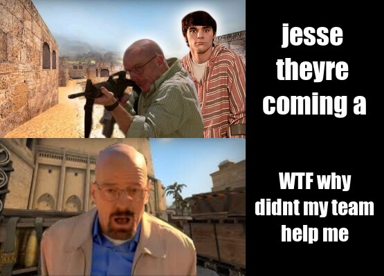

# Hello

## MEMES
 
 
I used the [magick](https://cran.r-project.org/web/packages/magick/vignettes/intro.html) package in R to create the meme below. 

```r 
library(magick)

before <- image_read("images/before.jpg") %>%
  image_scale(355)

after <- image_read("images/after.jpg") %>%
  image_scale(355)

goa <- image_blank(width = 200,
                   height = 200,
                   color = "#000000")%>%
  image_annotate(text = "jesse \ntheyre \ncoming a",
                 color = "#FFFFFF", 
                 size = 40,
                 font = "Impact",
                 gravity = "center")
wtfteam <- image_blank(width = 200,
                       height = 200,
                       color = "#000000")%>%
  image_annotate(text = "WTF why\ndidnt you\nhelp me",
                 color = "#FFFFFF",
                 size = 40,
                 font = "Impact",
                 gravity = "center")
first_row <- c(before, goa)%>%
  image_append()

second_row <- c(after, wtfteam)%>%
  image_append()

bingen <-c(first_row, second_row)%>%
  image_append(stack = TRUE)

image_write(bingen, "images/bingen.jpg")

```
[This meme](https://www.reddit.com/gallery/lre9ka) is the meme that I used to take inspiration for creating my own meme. 

The memes I enjoy tend to be intentionally terrible. This is prevelent throughout the Breaking Bad community, specifically on subreddits like ["okbuddychicanery"](https://www.reddit.com/r/okbuddychicanery/). 

Another source of inspiration I took is from Counter-Strike: Global Offensive, which is currently one of my most played videogames. 

My meme is original because I took inspiration from an existing format, but created my own meme with unique pictures and captions.

I also took inspiration for my meme from [4 Panel Cringe](reddit.com/r/4panelcringe), a subreddit that contains memes which feature the same format as my meme, while also emphasizing cringe and terrible humor. 

Below is an example of a 4 Panel Cringe meme.


